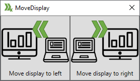
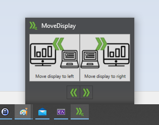

<!--Category:C#,WinApp--> 
 

      
    <a href="http://productivitytools.tech/MoveDisplay/"><a> 
    

    

# MoveDisplay

The application allows moving external display to the left or right side of the screen.

<!--more-->

The application was tested for laptop and one external display. 
<!--og-image-->

You can use the main buttons, and also the small buttons in the application preview.

It can be installed through **Windows store**.
